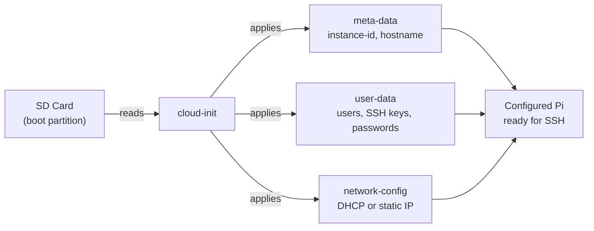
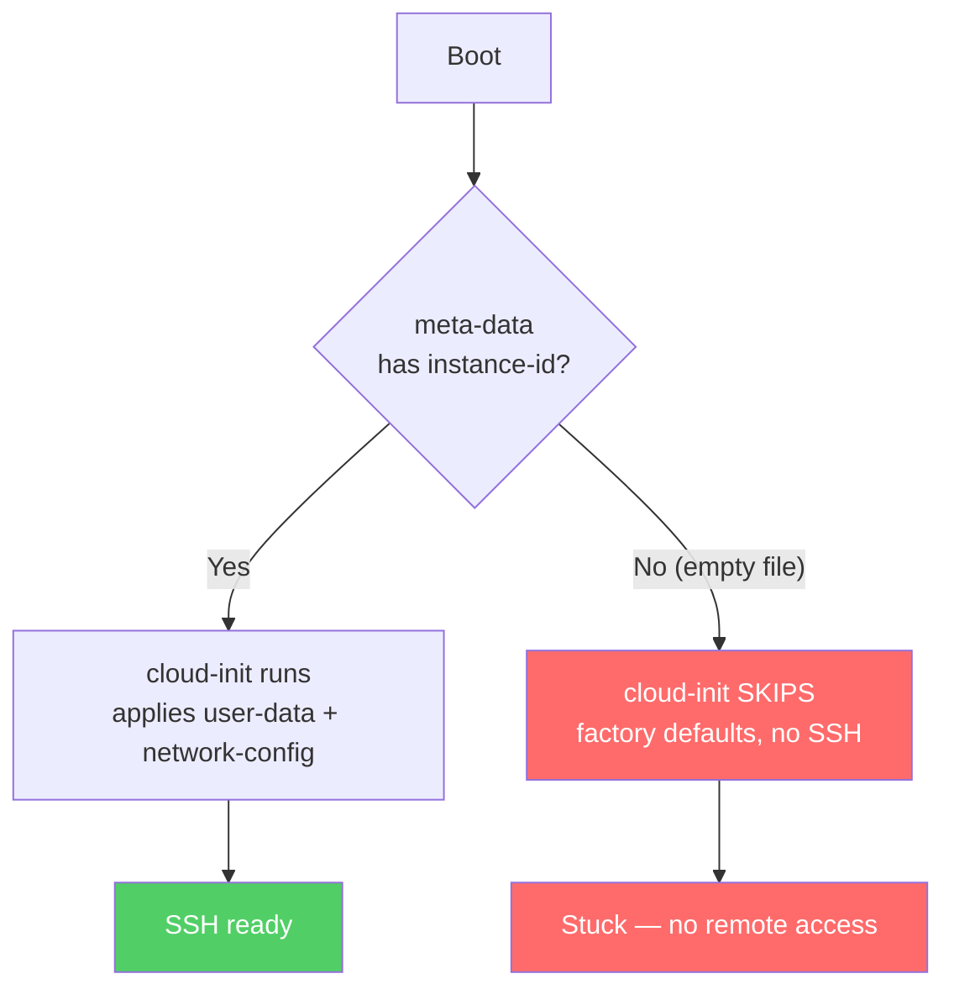
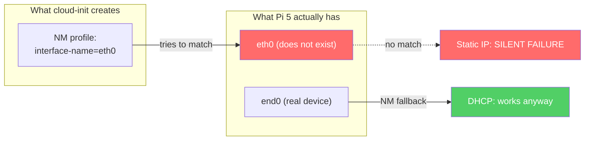
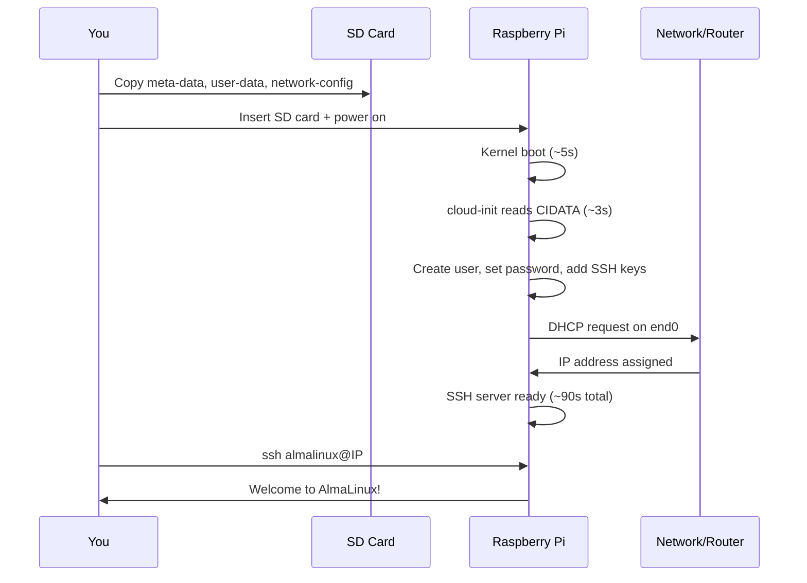

# AlmaLinux Raspberry Pi — Headless Cloud-Init Bootstrap

[](https://blueoakcouncil.org/license/1.0.0)
[](https://almalinux.org)
[](https://www.raspberrypi.com/products/raspberry-pi-5/)
[](https://github.com/ParkWardRR/almalinux-rpi-headless)
[](https://cloudinit.readthedocs.io/)
[](https://en.wikipedia.org/wiki/AArch64)
[](https://en.wikipedia.org/wiki/Headless_computer)
[](https://yaml.org/)
[](https://github.com/ParkWardRR/almalinux-rpi-headless/pulls)

Cloud-init configuration templates for running **AlmaLinux headless on Raspberry Pi 5** (and Pi 4).

The official [AlmaLinux Raspberry Pi wiki](https://wiki.almalinux.org/documentation/raspberry-pi.html) covers the basics but leaves out critical details that cause **silent boot failures** on headless setups. This repo documents the pitfalls and provides verified, copy-paste-ready templates.

> **Status: Verified working** on AlmaLinux 10.1 (Heliotrope Lion) / Raspberry Pi 5 (8GB) — March 2026.

---

## How It All Fits Together

> **In plain terms:** When you put an SD card into a Raspberry Pi and turn it on, the Pi needs to know things like "what's my hostname?", "who's allowed to log in?", and "how do I connect to the network?" Cloud-init is the program that reads your config files from the SD card's boot partition and sets all of this up automatically — so you never need to plug in a monitor or keyboard.



---

## Known Pitfalls

### 1. The `meta-data` File Ships Empty — This Is the #1 Killer

> **In plain terms:** Cloud-init needs a unique ID in the `meta-data` file to know "this is a new machine I should configure." The stock AlmaLinux image ships this file completely empty, so cloud-init thinks there's nothing to do and skips all your settings. Your Pi boots with factory defaults and you can't SSH in.

**This is the most critical issue.** The stock AlmaLinux RPi image includes an **empty** `meta-data` file. Cloud-init's NoCloud datasource requires a valid `instance-id` in `meta-data` to trigger processing. Without it, **cloud-init silently skips your `user-data` and `network-config` entirely** — the system boots with defaults and no SSH access.

```yaml
# meta-data — YOU MUST CREATE THIS
instance-id: my-rpi-v1
local-hostname: my-rpi
dsmode: local
```

<details>
<summary><b>Evidence from live system logs</b></summary>

Cloud-init searches for data on the boot partition via `blkid`:
```
DataSourceNoCloud.py[DEBUG]: Attempting to use data from /dev/mmcblk0p1
util.py[DEBUG]: Reading 62 bytes from /boot//meta-data
DataSourceNoCloud.py[DEBUG]: Using data from /dev/mmcblk0p1
```
When `meta-data` is empty (0 bytes), cloud-init finds `NO_PREVIOUS_INSTANCE_ID` and skips all processing. With a valid `instance-id`, it proceeds:
```
stages.py[DEBUG]: previous iid found to be NO_PREVIOUS_INSTANCE_ID
main.py[DEBUG]: [local] init will now be targeting instance id: rubrica-v1. new=True
```
</details>



### 2. Don't Create Custom Users — Modify `almalinux`

> **In plain terms:** The AlmaLinux image comes with a built-in user account called `almalinux`. If you try to create a totally new user in your config instead of modifying this existing one, the setup process can get confused and fail. Always modify the existing `almalinux` user — you can change its password, SSH keys, and group memberships freely.

The image ships with a hardcoded default user `almalinux` (password: `almalinux`). Creating a different user in `user-data` can break the init sequence.

<details>
<summary><b>Wrong</b> — Custom user</summary>

```yaml
users:
  - name: myuser          # Breaks AlmaLinux init
    groups: wheel
```
</details>

<details>
<summary><b>Right</b> — Modify default user</summary>

```yaml
users:
  - name: almalinux       # Modify the existing user
    groups: [ adm, systemd-journal ]
```
</details>

<details>
<summary><b>Evidence from live system logs</b></summary>

Cloud-init creates the user with `useradd` during the local init stage:
```
useradd[780]: new group: name=almalinux, GID=1000
useradd[780]: new user: name=almalinux, UID=1000, GID=1000, home=/home/almalinux, shell=/bin/bash
useradd[780]: add 'almalinux' to group 'adm'
useradd[780]: add 'almalinux' to group 'systemd-journal'
passwd[781]: password for 'almalinux' changed by 'root'
```
</details>

### 3. Pi 5 Ethernet Is `end0`, Not `eth0`

> **In plain terms:** Every network port on your computer has an internal name. On older Pi 4 boards, the ethernet port was called `eth0`. On the newer Pi 5, it's called `end0` (because the hardware is wired differently internally). If your config file says `eth0` but the Pi 5 is looking for `end0`, the Pi won't apply your network settings correctly. It's like mailing a letter to the wrong address — it just doesn't arrive.

The Raspberry Pi 5 names its onboard ethernet `end0` (not `eth0` like Pi 4). Cloud-init will create a NetworkManager profile targeting whichever name you put in `network-config`. If you use `eth0` on a Pi 5, the profile silently doesn't match any interface — DHCP may still work via NetworkManager's own fallback, but **static IP will silently fail**.

```yaml
# Pi 5
ethernets:
  end0:           # <- correct for Pi 5
    dhcp4: true

# Pi 4
ethernets:
  eth0:           # <- correct for Pi 4
    dhcp4: true
```

<details>
<summary><b>Evidence from live system logs</b></summary>

Cloud-init writes the NetworkManager connection file with whatever interface name you provide:
```
util.py[DEBUG]: Writing to /etc/NetworkManager/system-connections/cloud-init-eth0.nmconnection
```
The generated file contains `interface-name=eth0`, but the actual Pi 5 device is `end0`:
```
2: end0: <BROADCAST,MULTICAST,UP,LOWER_UP> state UP
   link/ether 2c:cf:67:df:4e:fe
```
NetworkManager's DHCP fallback saves you with automatic addressing, but any static IP config bound to `eth0` silently does nothing.
</details>



### 4. Use DHCP — Static IP via `network-config` Is Unreliable

> **In plain terms:** There are two ways to give your Pi a fixed IP address. The "automatic" way (through cloud-init's network config file) is buggy on AlmaLinux — it often silently fails. The reliable way is to boot with DHCP (let the router assign any IP), SSH in, and then set the static IP manually with a single command. It takes 30 extra seconds and actually works every time.

AlmaLinux's cloud-init has known issues translating `network-config` into NetworkManager profiles. Both v1 and v2 formats can silently fail, leaving the interface dead.

**The reliable approach:** Boot with DHCP, then configure static IP manually via `nmcli` after SSH access.

<details>
<summary><b>Evidence from live system logs</b></summary>

Cloud-init uses the `network-manager` renderer and writes NM connection files directly:
```
distros[DEBUG]: Selected renderer 'network-manager' from priority list: ['eni', 'netplan', 'network-manager', 'sysconfig', 'networkd']
network_state.py[DEBUG]: NetworkState Version2: missing "macaddress" info in config entry: eth0: {'dhcp4': True, 'optional': True}
```
The `missing "macaddress"` warning is informational, but the v2-to-NM translation has known edge cases where static config is silently dropped.
</details>

### 5. Use `gateway4`, Not `routes` (If You Must Use Static)

> **In plain terms:** There are two ways to tell cloud-init which router to use as your internet gateway. The newer `routes` syntax looks cleaner but gets silently ignored on this version of cloud-init. The older `gateway4` syntax is deprecated everywhere else, but it's the only one that actually works here.

If you insist on static IP via `network-config`, use the legacy `gateway4` syntax and always include `optional: true`:

```yaml
ethernets:
  end0:                      # "end0" for Pi 5, "eth0" for Pi 4
    gateway4: 192.168.1.1    # NOT routes: [{to: default, via: ...}]
    optional: true            # Prevents boot hang
```

### 6. Don't Use RPi Imager OS Customization

> **In plain terms:** The Raspberry Pi Imager app has a feature that lets you set passwords and Wi-Fi before flashing. This feature writes its own config files that conflict with cloud-init's files. When both try to configure the system, neither works correctly. Just flash the plain image and let cloud-init handle everything.

The Raspberry Pi Imager's built-in "OS Customization" [conflicts with AlmaLinux's cloud-init](https://wiki.almalinux.org/documentation/raspberry-pi.html#burn-raspberry-pi-image). Flash the image without customization.

---

## Quick Start

### Prerequisites

| Requirement | Notes |
|---|---|
| Raspberry Pi 5 or 4 | Tested on Pi 5 (8GB) |
| SD card | 16 GB minimum |
| Ethernet cable | Wi-Fi config via cloud-init is not supported on this image |
| AlmaLinux RPi image | [Download](https://wiki.almalinux.org/documentation/raspberry-pi.html#download-image) |

### 1. Flash the Image

```bash
# macOS
diskutil unmountDisk /dev/diskN
xzcat AlmaLinux-*-RaspberryPi-*.raw.xz | sudo dd of=/dev/rdiskN bs=1m status=progress

# Linux
sudo umount /dev/sdX*
xzcat AlmaLinux-*-RaspberryPi-*.raw.xz | sudo dd of=/dev/sdX bs=1M status=progress
```

> **Do NOT use RPi Imager's "OS Customization" feature.**

### 2. Mount `CIDATA` and Copy All Three Files

> **In plain terms:** The SD card has a small partition labeled `CIDATA` (Cloud-Init DATA). This is where cloud-init looks for its instructions. You're copying three small text files onto that partition — they tell the Pi who you are, what your password is, and how to connect to the network.

```bash
# macOS
diskutil mountDisk /dev/diskN

# Copy all three files (edit user-data first — see below)
cp user-data /Volumes/CIDATA/user-data
cp network-config /Volumes/CIDATA/network-config
cp meta-data /Volumes/CIDATA/meta-data    # <- CRITICAL — replaces the empty default

diskutil eject /Volumes/CIDATA
```

**Before copying `user-data`**, edit it to:
1. Replace the `passwd` hash with your own (`mkpasswd -m sha-512`)
2. Replace the SSH public key with yours

### 3. Boot and Connect

Insert SD card, connect ethernet, power on, wait **~90 seconds**.

> **In plain terms:** The Pi takes about 90 seconds because it's doing a lot on first boot: resizing the filesystem to fill your SD card, generating SSH encryption keys, creating your user account, and setting up networking. Subsequent boots are much faster.

```bash
# Find the Pi's DHCP-assigned IP from your router, then:
ssh almalinux@<DHCP_IP>
```



---

## File Reference

```
.
├── README.md          # This guide
├── LICENSE            # Blue Oak Model License 1.0.0
├── ROADMAP.md         # Future enhancements and ideas
├── user-data          # Cloud-init user config (SSH, password, hostname)
├── network-config     # DHCP network config (recommended)
├── meta-data          # Instance ID (CRITICAL — don't skip this)
└── TROUBLESHOOTING.md # Diagnostic steps when things go wrong
```

---

## After First Boot

> **In plain terms:** These are housekeeping tasks for your freshly booted Pi. The `sgdisk` command fixes a harmless but noisy disk warning, `dnf update` installs security patches, and the `nmcli` commands let you set a permanent static IP if you need one.

```bash
# Fix GPT backup header (the image's partition table doesn't match the SD card size)
sudo sgdisk -e /dev/mmcblk0

# Update the system
sudo dnf update -y

# Create additional users if needed
sudo useradd -m -G wheel,adm,systemd-journal -s /bin/bash myuser
sudo passwd myuser

# Set static IP via nmcli (if needed)
# Find the connection name first: nmcli connection show
sudo nmcli connection modify "Wired connection 1" \
  ipv4.method manual \
  ipv4.addresses "192.168.1.100/24" \
  ipv4.gateway "192.168.1.1" \
  ipv4.dns "8.8.8.8"
sudo nmcli connection up "Wired connection 1"

# Install tools
sudo dnf install -y podman vim tmux htop
```

---

## What Happens During First Boot

> **In plain terms:** This timeline shows exactly what the Pi does in the ~24 seconds of cloud-init processing. The whole boot (including the kernel and other services) takes about 90 seconds, but cloud-init's part is surprisingly fast.

The following timeline was captured from a live AlmaLinux 10.1 / Pi 5 system:

```mermaid
gantt
    title Cloud-Init Boot Timeline (Pi 5 — actual measurements)
    dateFormat X
    axisFormat %Ss

    section Local Stage
    Datasource detection + network render : 0, 3
    Hostname set to 'rubrica'             : 3, 4
    User + password + SSH keys            : 4, 7

    section Network Stage
    Network info + route tables           : 11, 12

    section Config Stage
    Module config                         : 12, 13

    section Final Stage
    SSH host key generation               : 13, 14
    Bluetooth/wifi disable (runcmd)       : 14, 15
    Boot finished                         : 15, 16
```



<details>
<summary><b>Raw timing evidence from cloud-init-output.log</b></summary>

```
Cloud-init v. 24.4-6.el10 running 'init-local' at Sun, 17 Aug 2025 00:00:07 +0000. Up 10.48 seconds.
Cloud-init v. 24.4-6.el10 running 'init' at Sun, 17 Aug 2025 00:00:18 +0000. Up 21.39 seconds.
Cloud-init v. 24.4-6.el10 running 'modules:config' at Sun, 17 Aug 2025 00:00:18 +0000. Up 21.86 seconds.
Cloud-init v. 24.4-6.el10 running 'modules:final' at Sun, 17 Aug 2025 00:00:19 +0000. Up 22.30 seconds.
Cloud-init v. 24.4-6.el10 finished at Sun, 17 Aug 2025 00:00:20 +0000. Up 23.61 seconds
```
Total cloud-init time: **13.13 seconds** (from 10.48s to 23.61s uptime).
</details>

---

## Verified Configuration

This exact configuration was tested and confirmed working:

| Component | Version / Detail |
|---|---|
| AlmaLinux | 10.1 (Heliotrope Lion) |
| Kernel | 6.12.47-20250916.v8.1.el10 (aarch64) |
| cloud-init | 24.4-6.el10 |
| Raspberry Pi | 5 (8GB) |
| Ethernet interface | `end0` (MAC: `2c:cf:67:*`) |
| Setup | Fully headless (no HDMI, no keyboard) |
| Network | DHCP via ethernet, 172.16.0.0/16 subnet |
| Boot time | ~24s for cloud-init, ~90s to SSH ready |
| Date verified | March 2026 |

<details>
<summary><b>Live system evidence</b></summary>

```
$ uname -a
Linux rubrica 6.12.47-20250916.v8.1.el10 #1 SMP PREEMPT aarch64 GNU/Linux

$ cloud-init status --long
status: done
detail: DataSourceNoCloud [seed=/dev/mmcblk0p1][dsmode=local]

$ ip addr show end0
2: end0: <BROADCAST,MULTICAST,UP,LOWER_UP> mtu 1500 state UP
    inet 172.16.20.197/16 brd 172.16.255.255 scope global dynamic noprefixroute end0

$ free -h
              total        used        free
Mem:          7.8Gi       361Mi       6.6Gi

$ df -h /
Filesystem      Size  Used Avail Use%
/dev/mmcblk0p2  227G  1.7G  225G   1%
```
</details>

## Boot Log Summary

> **In plain terms:** When the Pi starts up, the Linux kernel prints a bunch of messages. Most are normal, but a few look scary. Here's what you'll see and whether you should care.

| Log Message | Severity | What It Means |
|---|---|---|
| `GPT: Primary header thinks Alt. header is not at the end of the disk` | Warning | The SD card image was written to a bigger card than expected. Fix with `sudo sgdisk -e /dev/mmcblk0`. Harmless until fixed. |
| `bcm2708_fb: Unable to determine number of FBs` | Warning | The framebuffer (display) driver can't find a monitor. Expected on headless — ignore it. |
| `chronyd: System clock wrong by 17724365 seconds` | Warning | The Pi has no battery-backed clock. It starts in August 2025 and NTP corrects it to the real date within 30 seconds. |
| `NetworkManager: Couldn't initialize supplicant interface` | Error | Wi-Fi supplicant isn't ready. Expected — our config disables Wi-Fi anyway. |
| `irqbalance: Cannot change IRQ affinity: Permission denied` | Warning | IRQ balancing can't optimize certain interrupts. Harmless on single-purpose setups. |
| `hci_uart_bcm: supply vbat not found, using dummy regulator` | Warning | Bluetooth UART driver using placeholder power supply. Expected — we disable bluetooth. |
| `setregdomain: Process failed with exit code 1` | Warning | Wi-Fi regulatory domain not set. Irrelevant since Wi-Fi is disabled. |

## References

- [AlmaLinux Raspberry Pi Wiki](https://wiki.almalinux.org/documentation/raspberry-pi.html)
- [Cloud-init NoCloud Datasource](https://cloudinit.readthedocs.io/en/latest/reference/datasources/nocloud.html)
- [Cloud-init Network Config v2](https://cloudinit.readthedocs.io/en/latest/reference/network-config-format-v2.html)
- [Raspberry Pi 5 Hardware Documentation](https://www.raspberrypi.com/documentation/computers/raspberry-pi-5.html)
- [NetworkManager nmcli Reference](https://networkmanager.dev/docs/api/latest/nmcli.html)

## Contributing

Issues and pull requests welcome. If you've found additional pitfalls or workarounds, please share. See [ROADMAP.md](ROADMAP.md) for planned enhancements.

## License

[Blue Oak Model License 1.0.0](https://blueoakcouncil.org/license/1.0.0) — see [LICENSE](LICENSE).
