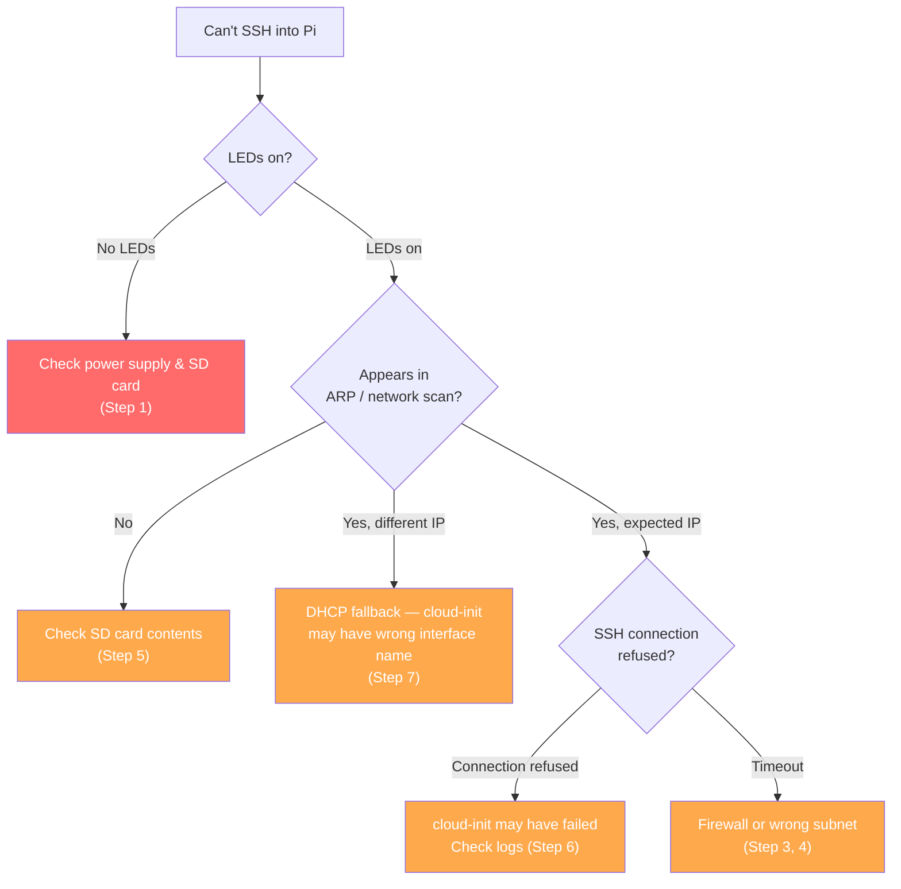
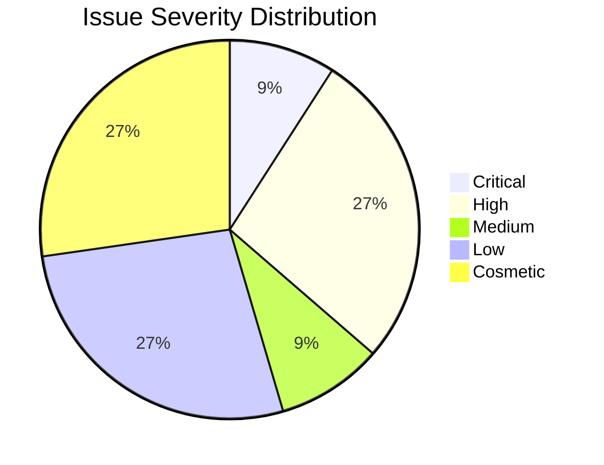

# Troubleshooting

Diagnostic steps when AlmaLinux doesn't respond after boot on a Raspberry Pi.

> **In plain terms:** You've put the SD card in, plugged in ethernet, and powered on the Pi — but you can't SSH in. This guide walks you through figuring out what went wrong, from the simplest physical checks to reading cloud-init's internal logs.



## Step 1: Verify Physical Layer

> **In plain terms:** Before diving into software, make sure the Pi is actually turning on and talking to the network. The LEDs on the board tell you a lot.

Before debugging cloud-init, confirm the Pi is actually powered and connected.

| Check | What to look for |
|---|---|
| **Power LED** | Solid red light on the Pi board |
| **Activity LED** | Green LED should flash during boot (SD card reads) |
| **Ethernet LEDs** | Orange (link) and green (activity) on the ethernet port |

If the **green activity LED never flashes**, the Pi is not reading from the SD card. Re-flash the image.

If **ethernet LEDs are off**, check the cable and switch port.

## Step 2: Check ARP Cache

> **In plain terms:** ARP is how devices on a local network discover each other's hardware addresses. Even if you can't connect to the Pi, checking the ARP cache tells you whether it's at least *electrically present* on the network and broadcasting its existence.

Even if you can't ping the Pi, it may have broadcast its MAC address on the network during boot.

```bash
# Flush and re-poll
sudo arp -d -a 2>/dev/null
ping -c 1 172.16.1.69  # or your static IP
arp -a | grep -v incomplete
```

If you see the Pi's MAC address (`d8:3a:dd:*` or `2c:cf:67:*` for Pi 5), the NIC is up but cloud-init may have configured the IP incorrectly.

> **Note:** Pi 5's ethernet interface is `end0`, not `eth0`. Check `network-config` uses the correct name for your board.

<details>
<summary><b>Evidence: MAC address from live Pi 5</b></summary>

```
2: end0: <BROADCAST,MULTICAST,UP,LOWER_UP> mtu 1500 state UP
    link/ether 2c:cf:67:df:4e:fe brd ff:ff:ff:ff:ff:ff
    altname enx2ccf67df4efe
    inet 172.16.20.197/16
```
Pi 5 MAC prefix is `2c:cf:67`. If you see this prefix in your ARP table, the Pi's NIC is up.
</details>

## Step 3: Scan the Subnet

> **In plain terms:** If the Pi got a different IP than you expected (because DHCP gave it a random address, or because your static IP config didn't apply), you can scan the whole network to find it. `nmap` checks every address for an open SSH port.

The Pi may have ignored the static config and fallen back to DHCP.

```bash
# Scan for SSH on your local subnet (adjust range)
nmap -p 22 --open 172.16.0.0/16 -T4

# Or use arp-scan if available
sudo arp-scan --localnet
```

Look for new hosts that appeared after you powered on the Pi.

## Step 4: Check If DHCP Was Assigned

> **In plain terms:** Your router keeps a list of every device it's given an IP address to. If the Pi is on the network, it'll show up in this list with its hostname and MAC address. Check your router's admin page (usually at 192.168.1.1 or similar).

If you have access to your router's admin panel or DHCP server logs, look for a new lease with:
- Hostname: `almalinux.local` (default) or your custom hostname (if cloud-init applied)
- MAC prefix: `d8:3a:dd` or `2c:cf:67` (Raspberry Pi 5)

## Step 5: Verify SD Card Contents

> **In plain terms:** Pull the SD card out and plug it back into your computer. Check that the config files are actually there, properly formatted, and that `user-data` starts with the magic header `#cloud-config`. YAML (the file format) is very picky about indentation — a single tab character instead of spaces will break everything silently.

Re-mount the SD card on your computer and verify:

```bash
# Check user-data starts with #cloud-config
head -1 /Volumes/CIDATA/user-data
# Expected: #cloud-config

# Check network-config exists and has content
cat /Volumes/CIDATA/network-config

# Check meta-data has an instance-id (CRITICAL)
cat /Volumes/CIDATA/meta-data
# Must contain: instance-id: something

# Validate YAML syntax (requires python3)
python3 -c "import yaml; yaml.safe_load(open('/Volumes/CIDATA/user-data'))"
python3 -c "import yaml; yaml.safe_load(open('/Volumes/CIDATA/network-config'))"
```

Common issues:
- Missing `#cloud-config` header in `user-data` (must be the **very first line**)
- Tabs instead of spaces in YAML (YAML requires spaces)
- Invisible BOM characters from Windows editors
- **Empty `meta-data` file** (the #1 cause — see README pitfall #1)


## Step 6: Check Cloud-Init Logs (Requires Display or SSH)

> **In plain terms:** If you can get access to the Pi (either through a monitor + keyboard or through SSH on whatever IP it ended up at), you can read cloud-init's own log files. These tell you exactly what cloud-init tried to do, what worked, and what failed. The `status --long` command gives you a quick pass/fail summary.

If you can connect a display (micro-HDMI for Pi 5, full HDMI for Pi 4) or have SSH access:

1. Login as `almalinux` / `almalinux` (default credentials)
2. Check cloud-init status:
   ```bash
   cloud-init status --long
   ```
3. Read the logs:
   ```bash
   sudo cat /var/log/cloud-init.log | tail -100
   sudo cat /var/log/cloud-init-output.log
   ```
4. Check NetworkManager:
   ```bash
   nmcli device status
   nmcli connection show
   ip addr show end0    # "end0" on Pi 5, "eth0" on Pi 4
   ```
5. Verify cloud-init created the NM connection with the correct interface:
   ```bash
   sudo cat /etc/NetworkManager/system-connections/cloud-init-*.nmconnection
   # Look for interface-name= — it must match the real device (end0 or eth0)
   ```

<details>
<summary><b>Evidence: what a successful cloud-init run looks like</b></summary>

```
$ cloud-init status --long
status: done
extended_status: done
boot_status_code: enabled-by-generator
detail: DataSourceNoCloud [seed=/dev/mmcblk0p1][dsmode=local]
errors: []
recoverable_errors: {}
```

Key things to check:
- `status: done` (not `error` or `running`)
- `DataSourceNoCloud [seed=/dev/mmcblk0p1]` confirms it found the CIDATA partition
- `errors: []` means no failures

If status shows `disabled` or mentions no datasource, your `meta-data` file is empty or missing.
</details>

## Step 7: Nuclear Option — DHCP Fallback

> **In plain terms:** If nothing else works, try the simplest possible config: just DHCP, no static IP, no extras. If *that* works, you know the Pi hardware is fine and the problem is in your network configuration. You can then set the static IP manually after logging in.

If static IP configuration continues to fail, try booting with DHCP first to confirm the hardware works:

Create a minimal `network-config` (use `end0` for Pi 5, `eth0` for Pi 4):
```yaml
version: 2
ethernets:
  end0:
    dhcp4: true
    optional: true
```

If DHCP works, the issue is specifically with static IP translation in cloud-init -> NetworkManager. Configure the static IP manually after SSH access:

```bash
# Find the connection name first
nmcli connection show
# Then modify it (name varies — could be "Wired connection 1" or "cloud-init end0")
sudo nmcli connection modify "Wired connection 1" \
  ipv4.method manual \
  ipv4.addresses "192.168.1.100/24" \
  ipv4.gateway "192.168.1.1" \
  ipv4.dns "8.8.8.8"
sudo nmcli connection up "Wired connection 1"
```

<details>
<summary><b>Evidence: NetworkManager renderer behavior</b></summary>

Cloud-init selects the NM renderer and generates connection files:
```
distros[DEBUG]: Selected renderer 'network-manager' from priority list: ['eni', 'netplan', 'network-manager', 'sysconfig', 'networkd']
util.py[DEBUG]: Writing to /etc/NetworkManager/system-connections/cloud-init-eth0.nmconnection - wb: [600] 288 bytes
```
The generated `.nmconnection` file:
```ini
[connection]
id=cloud-init eth0
uuid=1dd9a779-d327-56e1-8454-c65e2556c12c
autoconnect-priority=120
type=ethernet
interface-name=eth0    # <-- must match real device name!

[ipv4]
method=auto
may-fail=false
```
If `interface-name` doesn't match a real device, static IP config is silently ignored.
</details>

## Known Issues

| Issue | Severity | Status | Workaround |
|---|---|---|---|
| Pi 5 ethernet is `end0`, not `eth0` | **Critical for static IP** | **Confirmed** | Use `end0` in `network-config` for Pi 5 |
| Static IP via `network-config` not applied | High | Under investigation | Use DHCP, then configure via `nmcli` |
| `routes` syntax silently ignored | Medium | Confirmed | Use `gateway4` instead |
| Boot hangs without `optional: true` | High | Confirmed | Always include in `network-config` |
| RPi Imager customization breaks init | High | Confirmed by AlmaLinux | Flash without customization |
| GPT backup header wrong after partition resize | Low | Confirmed | Run `sudo sgdisk -e /dev/mmcblk0` after first boot |
| System clock off by months on first boot | Low | Expected (no RTC battery) | `chronyd` corrects via NTP; wait ~30s for time sync |
| `bcm2708_fb` probe fails on headless boot | Cosmetic | Harmless | Ignore — framebuffer driver not needed without display |
| Schema validation skipped (missing jsonschema) | Low | Confirmed | `sudo dnf install python3-jsonschema` if you need validation |
| `irqbalance` permission denied warnings | Cosmetic | Known kernel issue | Ignore — doesn't affect functionality |
| `setregdomain` fails on boot | Cosmetic | Expected | Irrelevant when Wi-Fi is disabled |


